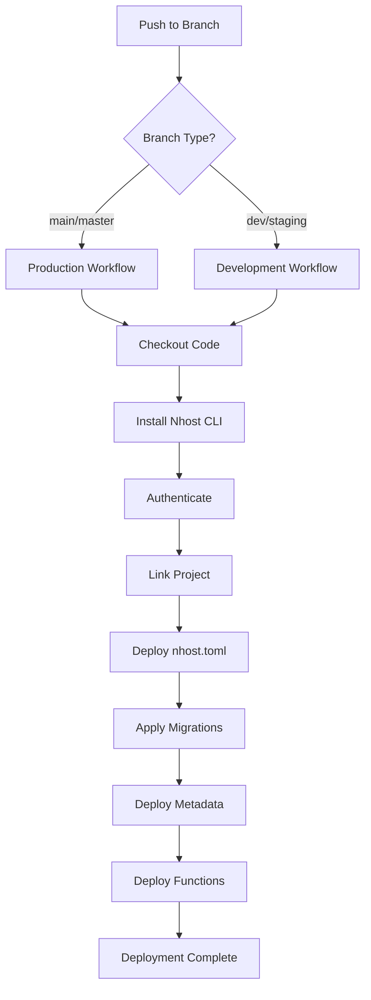

# Nhost CI/CD Setup Guide

## Quick Start

1. **Configure GitHub Secrets** (Repository Settings → Secrets and variables → Actions):
   
   **Production Secrets:**
   ```
   NHOST_PAT=your-personal-access-token
   NHOST_PROJECT_ID=your-production-project-id
   NHOST_SUBDOMAIN=your-production-subdomain
   ```

   **Development Secrets:**
   ```
   NHOST_DEV_PAT=your-dev-personal-access-token
   NHOST_DEV_PROJECT_ID=your-dev-project-id
   NHOST_DEV_SUBDOMAIN=your-dev-subdomain
   ```

2. **Configure GitHub Environments** (Repository Settings → Environments):
   - Create `production` environment
   - Create `development` environment
   - Add protection rules as needed

3. **Update Base Directory** (if your Nhost project is in a subfolder):
   Edit the `NHOST_BASE_DIRECTORY` in both workflow files:
   - `.github/workflows/deploy-production.yml`
   - `.github/workflows/deploy-development.yml`

4. **Push to trigger deployment:**
   - Push to `main`/`master` → Production deployment
   - Push to `dev`/`staging`/`develop` → Development deployment

## Deployment Flow



## Required Nhost Permissions

Your Personal Access Token needs these permissions:
- `projects:read`
- `projects:write`
- `deployments:create`
- `functions:deploy`
- `hasura:admin`

## Troubleshooting

### Common Issues

**Authentication Failed:**
- Verify your PAT is correct and has proper permissions
- Check if the PAT has expired

**Project Not Found:**
- Verify project ID and subdomain are correct
- Ensure the PAT has access to the project

**Migration Errors:**
- Check migration SQL syntax
- Verify database connection
- Review migration dependencies

**Function Deployment Failed:**
- Check TypeScript compilation errors
- Verify function exports are correct
- Review function dependencies in package.json

### Debug Mode

Add these steps to workflows for debugging:

```yaml
- name: Debug Info
  run: |
    echo "Current directory: $(pwd)"
    echo "Files in directory:"
    ls -la
    echo "Nhost config:"
    cat nhost.toml
```

## Manual Deployment

For local testing, use the deployment script:

```bash
# Make sure you're authenticated first
nhost auth login

# Run deployment
./scripts/deploy.sh

# Or specify environment
./scripts/deploy.sh production
```

## File Structure Explained

```
├── .github/workflows/           # CI/CD workflows
├── nhost/                      # Nhost configuration
│   ├── migrations/default/     # Database migrations
│   └── metadata/              # GraphQL metadata
├── functions/                 # Serverless functions
├── scripts/                   # Helper scripts
├── nhost.toml                # Main configuration
└── package.json              # Dependencies
```

## Environment-Specific Configuration

You can have different configurations per environment by using environment variables in your `nhost.toml`:

```toml
[auth.method.oauth.github]
enabled = true
client_id = "{{ AUTH_GITHUB_CLIENT_ID }}"
client_secret = "{{ AUTH_GITHUB_CLIENT_SECRET }}"
```

Then set different secrets for each environment in GitHub.